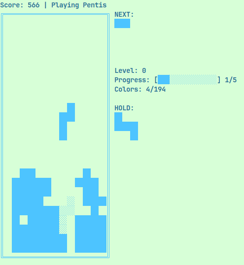

# N-is: A Generalized Tetris Game

N-is is a terminal-based puzzle game that generalizes the classic Tetris concept to work with polyominos of any size from 2 to 5 blocks. Play traditional Tetris (4 blocks) or experiment with Tris (3 blocks), Dis (2 blocks), or even challenging Pentis (5 blocks)!

<figure>
    
    <figcaption>Example game of tetris with extended mode enabled.</figcaption>
</figure>


## What It Does

- **Flexible Block Size**: Choose your game style with different block counts:
  - 1: "Mono" (single blocks)
  - 2: "Dis" (domino shapes)
  - 3: "Tris" (triomino shapes)
  - 4: "Tetris" (classic tetromino shapes)
  - 5: "Pentis" (pentomino shapes - more challenging)
  - 6: "Hexis" (hexomino shapes - extremely challenging, nearly unplayable)

- **Interactive Menu**: Run without arguments to access a user-friendly curses-based menu for selecting game options

- **Fun Mode**: Enable extended mode with `-e` flag to add non-standard polyominos (that can connect at vertices)

- **Customizable Colors**: Choose your preferred block and background colors with `-c` and `-bc` flags

- **Traditional Gameplay**: Features standard mechanics like:
  - Line clearing
  - Piece rotation
  - Scoring based on lines cleared
  - Increasing difficulty

## How to Run

### Interactive Mode 

Simply run the game without any arguments to access the interactive menu:

```bash
python n-is.py
```

This will launch a curses-based menu where you can:
- Select the game type (Mono, Dis, Tris, Tetris, Pentis, or Hexis)
- Choose whether to enable extended polyominos
- Navigate with arrow keys and confirm with Enter
- Quit the menu with 'q'

### Command Line Mode

For direct game launch with specific options:

```bash
python n-is.py <N> [-e] [-c COLOR] [-bc BACKGROUND_COLOR]
```

or:

```bash
py n-is.py <N> [-e] [-c COLOR] [-bc BACKGROUND_COLOR]
```

or:

```bash
./executable/n-is <N> [-e] [-c COLOR] [-bc BACKGROUND_COLOR]
```

It also can be compiled with:

```bash
pyinstaller n-is.py
```
the executable can be found in dist directory.


You can display help with:
```bash
python n-is.py -h
```

### Arguments:

- `N`: Optional - specifies the number of blocks (1-6). If omitted, interactive menu will appear
- `-e`: Optional - enables "fun" mode with additional shape variations
- `-c`: Optional - specifies the block color:
  - `r`: red
  - `g`: green
  - `b`: blue
  - `y`: yellow
  - `m`: magenta
  - `c`: cyan
  - `w`: white (default)
  - Numbers 0-255 are also accepted for extended color palette
- `-bc`: Optional - specifies the background color (numbers 0-255 only)
- `-h`: Shows help message
### Examples:

```bash
python n-is.py              # Interactive menu mode
python n-is.py 4            # Classic Tetris
python n-is.py 3 -e         # Tris with extended polyominos
python n-is.py 5 -c g       # Pentis with green blocks
python n-is.py 6 -c r -bc 4 # Hexis with red blocks on blue background
```

### Controls:

- **Left/Right Arrow**: move piece horizontally
- **Down Arrow**: drop
- **Up Arrow**: rotate piece
- **q**: quit game
- **u/i**: change main color
- **j/k**: change background color


## Dependencies

- Python 3.x
- curses, random and argparse libraries (included in standard Python installation)

The game is designed for terminal environments with adequate size. If you encounter this error:
```
Error running curses.
Your terminal may not be supported, or it probably is too small.
Curses error: addwstr() returned ERR
```
try increasing your terminal window size.

## Compatibility

| Operating System | Supported  | Notes                                          |
|------------------|------------|------------------------------------------------|
| Linux            | ✓          | Fully supported, tested on Fedora 42           |
| Windows 11       | ✓          | It works with new python installed             |
| macOS            | ?          | Expected to work properly (Unix-compatible), but i dont own a macOS machine to test this          |

## Why I Created This

I created N-is as an exploration of the Tetris concept, extending it to work with different polyomino sizes. This project demonstrates how the core mechanics of Tetris can be generalized, creating both simpler versions (Mono/Dis/Tris) and more complex versions (Pentis/Hexis).

The "fun" mode with non-standard shapes adds another layer of challenge and demonstrates how breaking traditional polyomino rules can lead to even more challenging gameplay.

It also serves as a practical example of terminal-based game development using Python and the curses library, showing how to handle user input, game logic, and rendering in a text-based environment.
